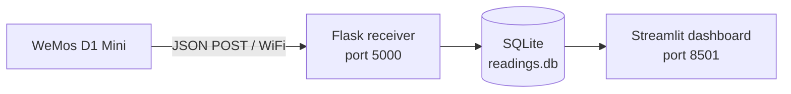

# AirQualityWeMos Sensors

Reads particulate matter and environmental data from a PMS5003 and BME680 sensor pair on a WeMos D1 Mini (ESP8266), then POSTs JSON readings over WiFi to a Python Flask receiver on a Windows PC. A Streamlit dashboard visualises the stored readings in real time.

---

## Hardware required

| Item | Notes |
|---|---|
| WeMos D1 Mini (ESP8266EX) | Any clone works — board package targets LOLIN D1 R2 & mini |
| PMS5003 | Plantower particulate matter sensor |
| BME680 | Bosch environmental sensor (breakout board with I2C pins) |
| Jumper wires | Male-to-female recommended |
| Breadboard | Optional but useful for combining GND wires |
| USB cable | Micro-USB for the WeMos |
| Windows PC | Runs the Flask receiver and Streamlit dashboard |

Software: Arduino IDE 2.x, Python 3.9 or later.

---

## Readings explained

### Particulate matter — PMS5003

The PMS5003 uses a laser to count particles suspended in the air and reports their mass concentration in **µg/m³** (micrograms per cubic metre).

| Reading | What it measures |
|---|---|
| PM1.0 | Particles ≤ 1 µm — ultrafine, penetrate deep into the lungs |
| PM2.5 | Particles ≤ 2.5 µm — fine particles, the primary health concern |
| PM10 | Particles ≤ 10 µm — includes dust, pollen, and mould spores |

**WHO 24-hour guideline levels (2021):**

| Pollutant | WHO guideline |
|---|---|
| PM2.5 | 15 µg/m³ |
| PM10 | 45 µg/m³ |

Clean indoor air typically reads below 10 µg/m³ for PM2.5. Cooking, candles, or poor ventilation can push readings well above 35 µg/m³.

### Environmental — BME680

| Reading | Unit | Notes |
|---|---|---|
| Temperature | °C | Measured at the sensor; may read slightly above ambient due to self-heating |
| Humidity | % RH | Relative humidity |
| Pressure | hPa | Atmospheric pressure at the sensor's elevation |
| Altitude | m | Derived from pressure using a sea-level reference — update `SEA_LEVEL_HPA` in config.h to your local value for accurate readings |

---

## Wiring

> **Connect sensors before powering the WeMos.** `sensors.begin()` runs once at startup — sensors not connected at boot will not be read until the next reset.

### PMS5003 (SoftwareSerial — D5 / D6)

The PMS5003 communicates over serial UART and runs on 5 V. The sensor's TX (it transmits data) connects to the WeMos's receive pin D5, and the sensor's RX (it receives commands) connects to the WeMos's transmit pin D6. Do not connect TX to TX. Do not use the hardware TX/RX pins.

| PMS5003 | WeMos D1 Mini | Notes |
|---|---|---|
| VCC (pin 1) | 5V | Sensor requires 5 V — do not use 3V3 |
| GND (pin 2) | GND | See GND note below |
| TX (pin 3) | D5 (GPIO14) | Sensor transmits → WeMos receives |
| RX (pin 4) | D6 (GPIO12) | WeMos transmits → sensor receives |

### BME680 (I2C — D1 / D2)

The BME680 runs on 3.3 V. Do not connect it to 5 V.

| BME680 | WeMos D1 Mini |
|---|---|
| VIN | 3V3 |
| GND | GND |
| SDA | D2 (GPIO4) |
| SCL | D1 (GPIO5) |

### GND note

The WeMos D1 Mini has **only one GND pin** on the main header. Twist the PMS5003 GND wire and the BME680 GND wire together and insert them into the same breadboard row connected to that pin.

---

## LED status

The onboard LED (D4 / GPIO2, active-LOW) gives visual feedback without a serial connection:

| Pattern | Meaning |
|---|---|
| Solid on | Sensor reading in progress |
| 3 rapid blinks (100 ms) | HTTP POST sent to receiver |
| 5 slow blinks (500 ms) | One or both sensor reads failed |
| Off | Idle — waiting for next reading interval |

---

## Configuration

All tuneable values are in `firmware/AirQualityWeMos/config.h`:

| Define | Default | Description |
|---|---|---|
| `RECEIVER_HOST` | — | IP address of the Windows PC running receiver.py. Run `ipconfig` on the PC and use the IPv4 address of the WiFi adapter. |
| `RECEIVER_PORT` | `5000` | Port the Flask receiver listens on |
| `RECEIVER_PATH` | `/readings` | POST endpoint path |
| `BME680_I2C_ADDR` | `0x77` | BME680 I2C address. If init fails, run the `firmware/i2c_scanner/` sketch to find the correct address (either `0x76` or `0x77`). |
| `SEA_LEVEL_HPA` | `1013.25` | Sea-level pressure for altitude calculation — update to your local weather station's current value |
| `PMS_WARMUP_MS` | `30000` | PMS5003 fan warm-up time on boot (ms) |
| `READING_INTERVAL_MS` | `900000` | Time between readings (ms) — 15 minutes |
| `HTTP_TIMEOUT_MS` | `10000` | HTTP POST timeout (ms) |

---

## Receiver environment variables

`receiver.py` reads these from the environment (or a `.env` file in the `receiver/` folder):

| Variable | Default | Description |
|---|---|---|
| `DB_PATH` | `receiver/readings.db` | Path to the SQLite database file |
| `HOST` | `0.0.0.0` | Interface the Flask server binds to |
| `PORT` | `5000` | Port the Flask server listens on |

---

See **[INSTALL.md](INSTALL.md)** for full setup, flashing, and troubleshooting instructions.
